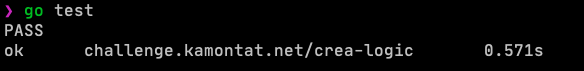
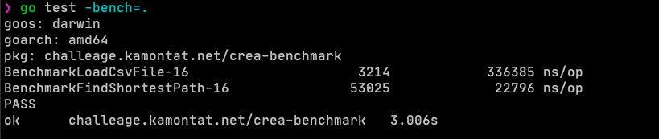

# Crea-Challenge

I write this commandline interface by `golang` with zero dependencies. Each directory is a module create by using `go mod init` command.

## Modules

1. [app](app) - Core application as commandline interface (cli)
2. [datasource](datasource) - Database APIs for loading data from [db](app/db)
3. [model](model) - Core model using across modules
4. [logic](logic) - dijkstra algorithm implementation
5. [formatter](formatter) - Convert result from `logic` to readable print in console
6. [benchmark](benchmark/go.mod) - benchmark test

## Usage

I have compiled version of application in [cli](cli) directory. 
Input database must be in **db** directory on current path.

You have 2 ways to run application

1. Run via **go** command - `go run ./main.go [-db=example.csv] [-start=A] [-end=D]` (go inside app directory first)
2. Run via compiled - `./shortest-path [-db=example.csv] [-start=A] [-end=D]` (go inside cli directory first)

## Test

Each module will have it own test case, but some of module might not have test.

### Test result

## Benchmark

Benchmark test is in [benchmark](benchmark) directory. You can run by `go test -bench=.`

### Benchmark result

## Credit

Kamontat Chantrachirathumrong